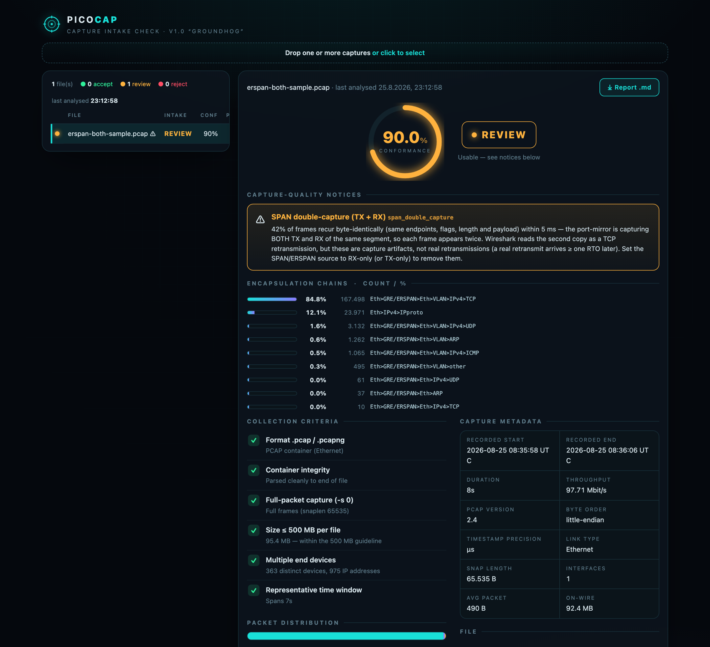

# PicoCap 🩺

**The tiny PCAP / PCAPNG capture intake checker.**

[](https://github.com/dirnberg/picocap/actions/workflows/ci.yml)


> **What it does:** point PicoCap at a pcap/pcapng and it tells you — in the CLI or
> a small web GUI — whether the capture is *clean and usable as evidence*: it checks
> the file against the PCAP Collection Guide, scores its conformance, breaks down the
> packet distribution and encapsulation (VLAN, GRE/ERSPAN/VXLAN), and flags the
> mistakes that quietly ruin OT captures — **SPAN double-capture (TX + RX)**,
> **dropped segments** (sequence gaps + ACKed-unseen), and **one-directional
> captures**. Multi-GB files stream from disk. Every finding cites a source, and
> nothing leaves the machine. Read-only: it never rewrites or forwards the file.

PicoCap takes **one** capture and answers a single question: *is this capture good
enough to work with?* It verifies the file against the **PCAP Collection Guide**
criteria, decodes the packet distribution and encapsulation, and flags mirror
double-captures, dropped segments and one-directional captures. It only ever
**reads** a file; it never rewrites or forwards it.

Pure Rust, no `libpcap`, no system dependencies. CLI + a self-contained web GUI.



---

## What it checks

- **Container integrity** + SHA-256 fingerprint
- **Conformance score** — 100 % *only* when every criterion passes; deviations and
  findings pull it down (so it isn't always "100 %")
- **Collection criteria:** format `.pcap`/`.pcapng`, full-frame capture (`-s 0` /
  snaplen), ≤ 500 MB per file, endpoint diversity (many devices), representative
  duration
- **Tunnel decapsulation** — GRE / ERSPAN / VXLAN, **nested**, then analyses the
  *inner* frame (so ERSPAN captures report real devices, not just the collector)
- **VLAN / QinQ** detection (+ distinct VLAN IDs) and nested-encapsulation depth
- **Encapsulation-chain distribution** — every stack (e.g.
  `Eth>GRE/ERSPAN>Eth>VLAN>IPv4>TCP`) with **count / %**
- **SPAN double-capture (TX + RX)** — frames whose inner L3 content recurs within a
  short window are mirror duplicates, not real retransmissions
- **TCP session integrity** — handshake coverage per session (complete / **SYN-only**,
  i.e. one-directional / **mid-stream**, i.e. capture started late)
- **Capture-drop detection** — **sequence gaps** + **ACKed-unseen** segments = data
  the endpoints exchanged but the file is missing (RFC 9293 §3.4), cross-checked
  with `tshark`. This is the core "is the capture complete?" check.
- **Frame-length anomalies** — runt / oversize / **NIC-offload super-frames** (TSO/GRO)
- **Encapsulation RFC conformance** — inner-length truncation, **VXLAN on legacy UDP
  8472** (vs RFC 7348 port 4789), and **malformed VXLAN headers** (RFC 7348 §5 violation)
- **Capture metadata** — recording start/end (UTC), duration, pcap version, byte
  order, timestamp precision, link type, throughput, avg packet size

Verdict is one of **ACCEPT · REVIEW · REJECT**. Every criterion cites an
authoritative **source** (RFC / Wireshark / Zeek / packet-foo / SANS ISC) — in the
JSON, the report and the GUI — see [`docs/CHECKS.md`](docs/CHECKS.md). Multi-GB
captures **stream from disk** (tested to 5.5 GB, ~flat memory). Processing is
**local only**: no cloud, and every report carries a trust note.

## Install / build

```bash
cargo build --release
# binary: ./target/release/picocap
```

## CLI

```bash
picocap capture.pcap              # text summary + verdict (exit 0/1/2)
picocap --report capture.pcap     # full Markdown assessment report → stdout
picocap --report big.pcapng > big-assessment.md
picocap serve                     # start the web GUI (see below)
picocap --version                 # picocap 1.4.0 "Staghound"
```

`--report` has no size limit, so it also handles multi-GB captures the GUI upload
would reject.

## Web GUI

```bash
picocap serve                     # http://127.0.0.1:8088  (localhost by default)
```

- **Two-pane dashboard:** file list (left) + full report (right)
- **Drop many files at once**; identical files are collapsed by SHA-256, with a
  "last analysed" timestamp
- Radial **conformance gauge**, capture-quality notices, collection-criteria
  checklist, packet distribution, **encapsulation-chain chart**, metadata
- **⤓ Report .md** — one-click download of the server-generated Markdown
  assessment (same source as the CLI `--report`), no print dialog

## Docker

The image is unprivileged and writes nothing to disk.

```bash
# with docker compose (put a token in .env — see .env.example)
docker compose up -d

# or plain docker, hardened, localhost-only, with a token
docker run --rm -p 127.0.0.1:8088:8088 -e PICOCAP_TOKEN=<token> \
  --read-only --cap-drop ALL --security-opt no-new-privileges --tmpfs /tmp \
  picocap:1.4.0

# CLI inside the container (read-only mount)
docker run --rm -v "$PWD:/d:ro" picocap:1.4.0 /d/capture.pcap
```

## Configuration — `picocap.yml`

Every tunable lives in `picocap.yml` (override the path with `$PICOCAP_CONFIG`).
Copy `picocap.example.yml` to start.

| Key | Default | Meaning |
|---|---|---|
| `listen_addr` | `127.0.0.1:8088` | Bind address. `0.0.0.0` exposes on the LAN — only with a token. |
| `auth_token` | *(empty)* | Empty = no auth. Set a long random token to require it. |
| `max_upload_mb` | `768` | Largest file the GUI accepts. |
| `size_limit_mb` | `500` | Per-file size guideline. |
| `full_snaplen` | `65535` | Snap length expected from `-s 0`. |
| `devices_min_ok` | `5` | ≥ this many devices → pass. |
| `devices_min_warn` | `2` | < this many devices → fail. |
| `duration_min_s` | `5` | Shorter captures are only warned. |
| `dup_window_ms` | `5` | Two identical frames within this window = mirror duplicate. |
| `dup_notice_pct` | `10` | Raise the `span_double_capture` notice at/above this %. |

Environment overrides (handy for Docker): `PICOCAP_TOKEN`, `PICOCAP_LISTEN`.

## Security

- **Localhost by default** — not reachable from the network out of the box.
- **Token auth** protects both the GUI (HTTP Basic: user = anything, password =
  token) and the API (`Authorization: Bearer <token>`).
- The token protects *access*, not confidentiality — HTTP sends it in the clear.
  For remote use, put it behind an **SSH tunnel** (`ssh -L 8088:127.0.0.1:8088 …`)
  or a **TLS reverse proxy**.
- Keep `picocap.yml` private (`chmod 600`); it holds the token in plain text and is
  git-ignored. See [SECURITY.md](SECURITY.md).

## How it works

Pure-Rust pipeline: [`pcap-parser`](https://crates.io/crates/pcap-parser) walks the
container, `sha2` fingerprints it, and a small hand-rolled decoder peels
Ethernet / VLAN / GRE / ERSPAN / VXLAN to reach the inner frame for classification
and duplicate detection. The GUI is [`axum`](https://crates.io/crates/axum) with the
page embedded in the binary (`include_str!`) — nothing to serve from disk.

## Tests

```bash
cargo test
```

A regression suite drives `analyze()` with **synthetic captures** built in-test —
plain Ethernet, broadcast/multicast, VLAN and **QinQ**, **VXLAN** and **ERSPAN**
tunnels, a truncated file, and a **SPAN double-capture** scenario — asserting the
decapsulation, VLAN/chain counting, duplicate detection and conformance scoring.
This exercises the tunnel/VLAN paths for which real-world captures may not be at
hand.

## Releases

Full notes: [GitHub Releases](https://github.com/dirnberg/picocap/releases). Change log: [`EVOLUTION.md`](EVOLUTION.md).

### v1.4.0 — "Staghound" (2026-08-27)
Adds the **egress-tag artifact** to the SPAN double-capture finding: when the two
mirror copies of a frame differ in VLAN tagging (one tagged, one not), the switch
applied the tag before the untag step — a chipset artifact on HP/Aruba, Cisco
SG200, Juniper EX. A measure-first feature — a corpus probe showed pure directional
tag-asymmetry is 0.1 % of streams (routing noise, not worth its own check), while
the egress-copy artifact shows up in ~8 % of VLAN captures, always *inside* a
double-capture — so it is surfaced as an annotation there, not beside it.

### v1.3.0 — "Wolfhound" (2026-08-27)
Grounded in a review of ~180 vendor/forum field reports on SPAN/mirror/TAP
behaviour. Adds a **capture-source fingerprint** (tunnel mirror · host tcpdump/
Wireshark · local SPAN — inferred from format/snaplen/encapsulation/offload, not a
device verdict), a **"mirror sees only ARP/broadcast"** notice (a virtual bridge
eating the mirror frames, or offload bypassing the sniffer — the #1 forum symptom),
**timestamp-integrity** checks (multi-day gap = merged/replayed capture; astronomical
gap = broken capture clock), and makes **SPAN double-capture TTL-tolerant** so a
*routed* both-direction mirror (copies differ only in TTL) is caught, not just a
switched byte-identical one.

### v1.2.0 — "Foxhound" (2026-08-27)
Adds **capture completeness at the TCP-session level** — handshake coverage
(complete / SYN-only / mid-stream) and **capture-drop detection** (sequence gaps
+ **ACKed-unseen** segments, RFC 9293 §3.4, cross-checked with `tshark`). Plus
encapsulation/RFC conformance (inner-length truncation, NIC-offload super-frames,
VXLAN on legacy 8472, and **malformed VXLAN headers = RFC 7348 §5 violation**).
Multi-GB captures now **stream from disk** (tested to 5.5 GB, ~flat memory). Every
finding cites a **source** (RFC / Wireshark / Zeek / packet-foo …), and every
report carries a trust note: processed locally, no cloud, calibrated against a
golden set cross-checked with `tshark` (see [`docs/CHECKS.md`](docs/CHECKS.md)).
The codename nods to the namesake check: a foxhound follows a scent trail without
losing it — like tracking each TCP session's sequence trail to see where the
capture dropped it.

### v1.0.0 — "Groundhog" (2026-08-25)
First full release. See the feature list above. The codename nods to the namesake
check: SPAN double-capture makes every frame show up twice.

## Design manifest

The principles PicoCap is built on, listing only what is actually implemented here, are in [MANIFEST.md](MANIFEST.md).

## License

[MIT](LICENSE) © 2026 Herbert Dirnberger
